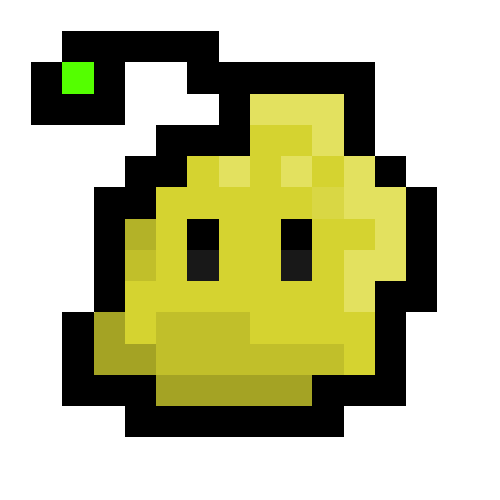
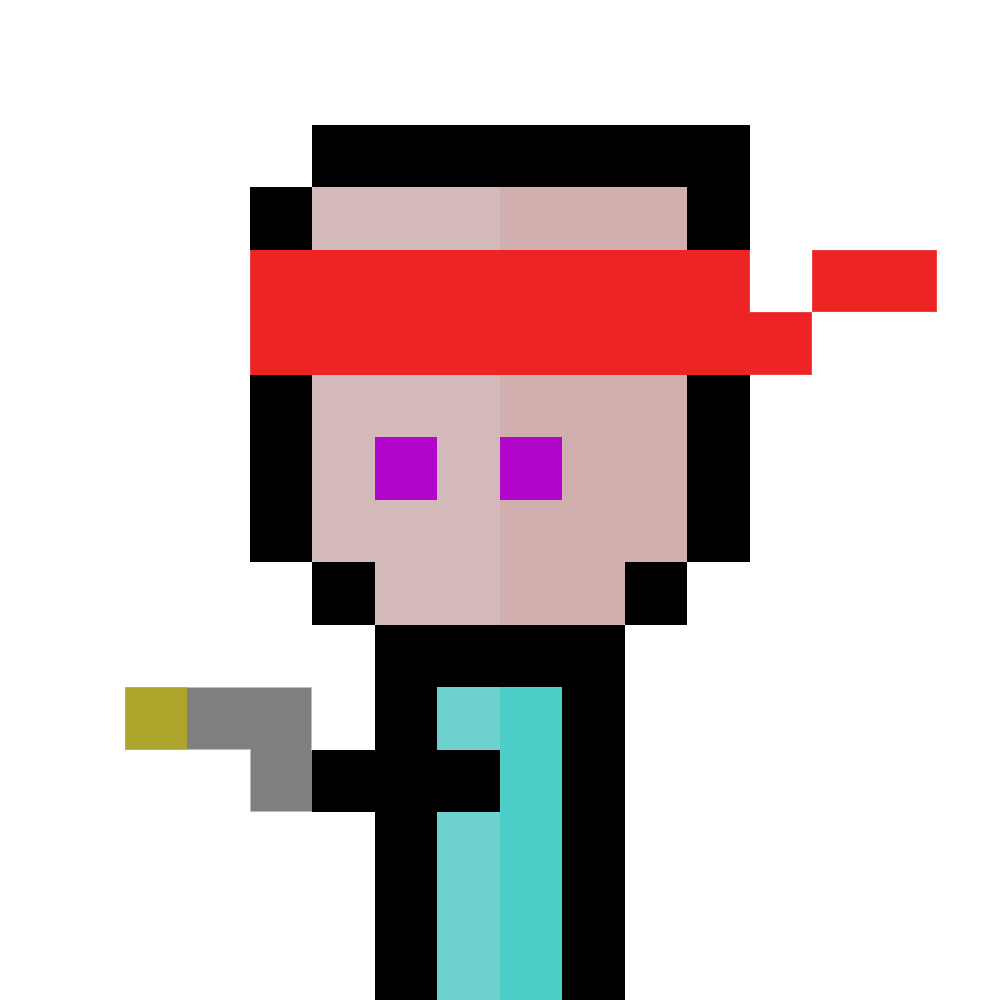
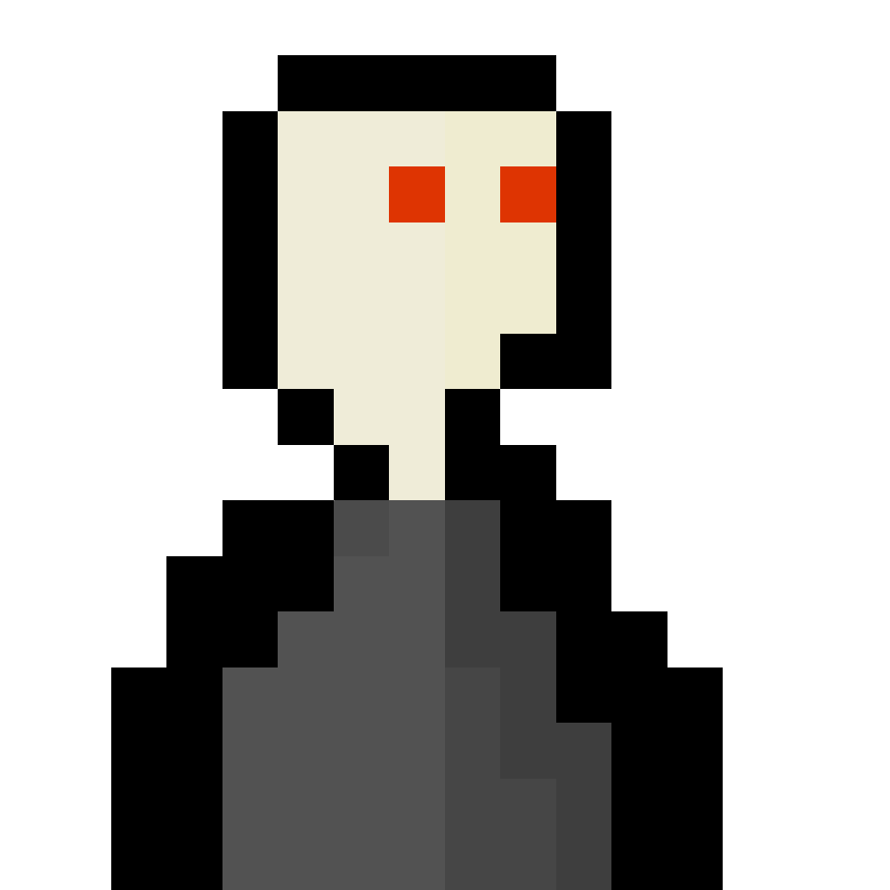
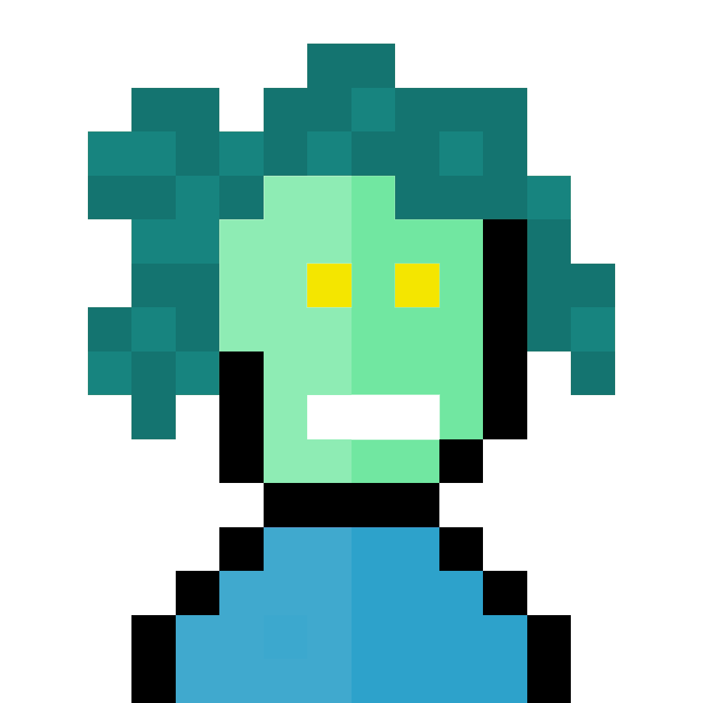

# Concept

A simple browser game that allows users to collect different types of monsters. Users are rewarded for keeping the game open in the browser and gain passive resources to continue the gameplay loop ♾.

# Quick Guide

The aim of the game is collect all of the monsters with their best stats. Currently there are 36 to collect!

- To roll a new monster, press the roll button in the bottom right
- To attempt to catch, press the catch button in the bottom left. You will be notified if you sucessfully catch or not!
- To get a rare encounter, you need 10 soul shards. To gain soul shards, click the menu in the top left, then go into your monster bag. Here you will be presented with all the monsters you have caught. Delete monsters you don't want to gain 1 soul shard.
- You gain experience by sucessfully catching monsters and will level up upon reaching experience breakpoints.
- passive refresh will happen evey 10 minutes of playtime, which will give you a number of rolls and catches!

# Further game information

### Level Breakpoints

- Level 1: < 140 xp
- Level 2: 140 xp
- Level 3: 196 xp
- Level 4: 274 xp
- Level 5: 384 xp
- Level 6: 537 xp
- Level 7: 752 xp
- Level 8: 1054 xp
- Level 9: 1475 xp
- Level10: 2066 xp

<b>Leveling up is KEY as the higher your level, the higher the monster stats when rolling a new enemy.</b>

# Technologies

Javascript, LocalStorage (used as game save state), SASS

# Current Features

- Local Storage acts as a save state to allow users to continue their game in the future.
- Different Rarities of monsters to catch. An Algorithm picks a monster each turn for the user to catch.
- Users earn passive resources which allow gameplay to continue indefinately.
- Global variables allow easy control of certain game features including catch chance, probility of getting a rare encounter, passive resource generators
- The colour scheme of the game changes based on the time of day

&nbsp;

# Potential future updates

- Lock enemy functionality (so refresh does not auto-roll)
- Use caught monsters to fight in battles
- Weekly events where users can use gain increases in rare encounter probablities etc.
- Users will be able to can make an account
- Save state inside of database not local Storage
- online leaderboards

# Art

The Game contains many different pixel art pieces. Collect them all!

&nbsp;

&nbsp;
